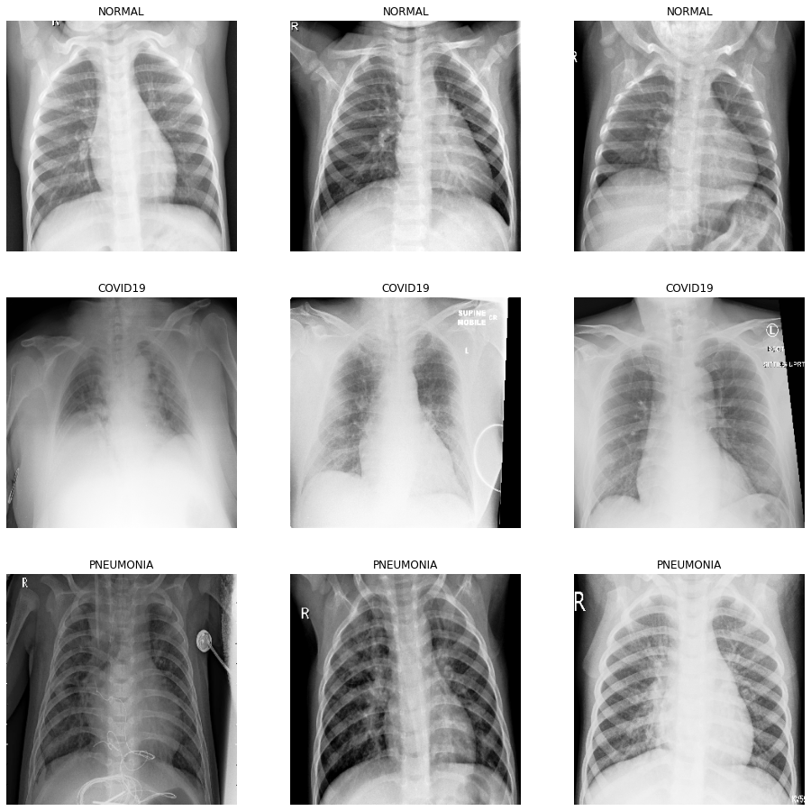
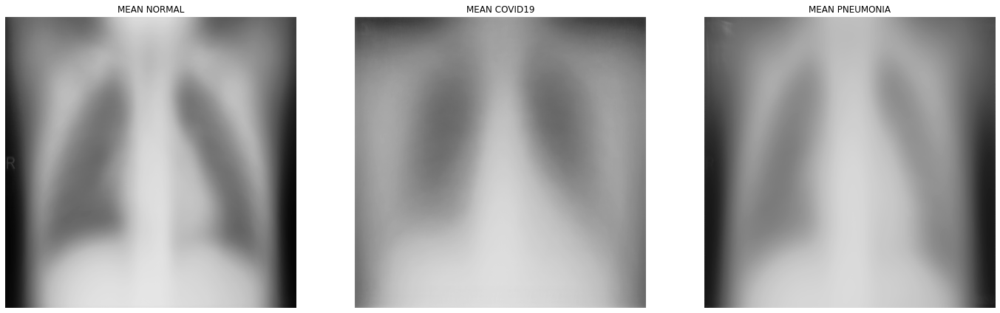
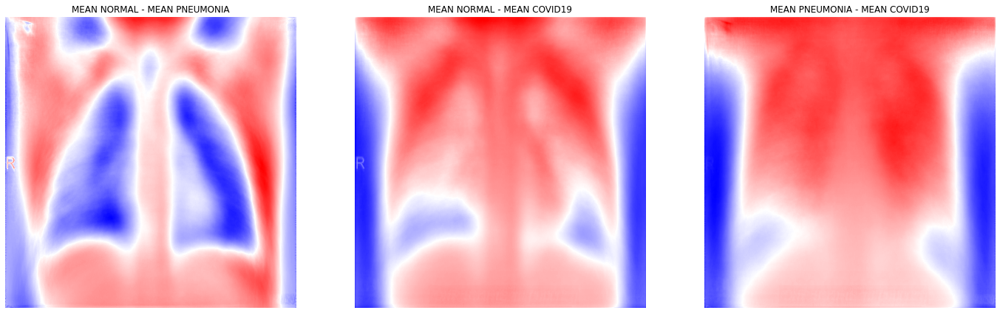

# Chest X-Ray Diagnosis
The kaggle computer vision task: https://www.kaggle.com/datasets/prashant268/chest-xray-covid19-pneumonia

## Data
> Dataset is organized into 2 folders (train, test) and both train and test contain 3 subfolders (COVID19, PNEUMONIA, NORMAL).
> Dataset contains total 6432 x-ray images and test data have 20% of total images.

 

   &nbsp;&nbsp;
   &nbsp;&nbsp;
   &nbsp;&nbsp;

## Libraries
pip:    &nbsp;&nbsp;&nbsp;&nbsp;&nbsp;&nbsp;&nbsp;  `pip install -r requirements.txt`  
conda:   &nbsp;&nbsp; `conda create --name <env> --file requirements.txt`

**Most important**:
+ tensorflow
+ pillow
+ sklearn
+ matplotlib

## Data Exploration

> The code for this section is available in `data_exploration/data_exploration.ipynb` notebook.

To start with, we can check how many images are in each class.

**Normal:**  &nbsp;&nbsp;&nbsp;&nbsp;&nbsp;&nbsp; &nbsp;&nbsp;  **1266**  
**Covid-19:**  &nbsp;&nbsp;&nbsp;&nbsp;&nbsp;&nbsp; **460**  
**Pneumonia:** &nbsp;&nbsp;  **3418**

As we see, this is an example of skewed data. Hence, I will use precision, recall, and f1-score as metrics besides accuracy.

### Raw Comparison

 

   &nbsp;&nbsp;

### Means

 

   &nbsp;&nbsp;

### Contrast Between Means

 

   &nbsp;&nbsp;

### Thoughts

+ What about some bias? Is one gender much more prone to covid-19 or pneumonia? If yes, the model may learn to recognize a breast...
+ Can the mean be used as a feature? More precisely, can we consider a "distance" from the mean as a feature?

## Transfer Learning
Models are based on pretrained, on imagenet, CNN base models. These are:
+ EfficientNetB3
+ InceptionV3
+ MobileNetV2

## Hyperparameter Search
I use the TensorBoard tool to track experiments and metrics like accuracy and loss.

To inspect results of the experiments, run the `Launch Tensorboard Session` button in the `hp_search/hp_search.ipynb` notebook.

Optimized hyperparmeters:
+ dropout rate
+ learning rate
+ optimizer

Nevertheless, I cannot conduct an accurate tuning with lots of models and hyperparameters because of a lack of time and computational power. Hence, I used a grid search testing only three hyperparameters. The aim was to try the TensorBoard tool, which was successfully done. 

   &nbsp;&nbsp;&nbsp;
  

## References
+ https://www.kaggle.com/datasets/prashant268/chest-xray-covid19-pneumonia
+ https://towardsdatascience.com/exploratory-data-analysis-ideas-for-image-classification-d3fc6bbfb2d2
