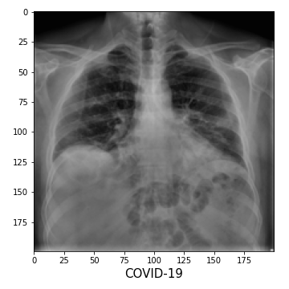
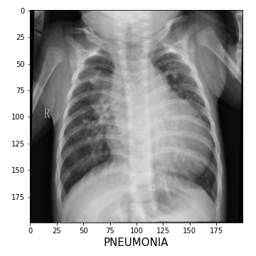
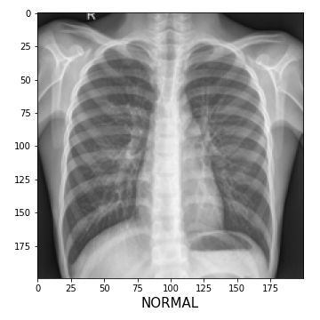

# Chest X-Ray Diagnosis
The kaggle computer vision task: https://www.kaggle.com/datasets/prashant268/chest-xray-covid19-pneumonia

## Data
> Dataset is organized into 2 folders (train, test) and both train and test contain 3 subfolders (COVID19, PNEUMONIA, NORMAL).
> Dataset contains total 6432 x-ray images and test data have 20% of total images.

   &nbsp;&nbsp;
   &nbsp;&nbsp;
   &nbsp;&nbsp;

## Libraries
`pip install -r requirements.txt` or `conda create --name <env> --file requirements.txt`

+ tensorflow
+ pillow
+ sklearn
+ matplotlib
