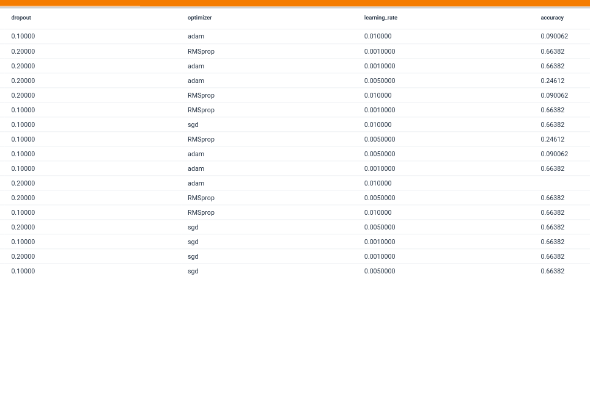

# Chest X-Ray Diagnosis
The kaggle computer vision task: https://www.kaggle.com/datasets/prashant268/chest-xray-covid19-pneumonia

## Data
> Dataset is organized into 2 folders (train, test) and both train and test contain 3 subfolders (COVID19, PNEUMONIA, NORMAL).
> Dataset contains total 6432 x-ray images and test data have 20% of total images.

   &nbsp;&nbsp;
   &nbsp;&nbsp;
   &nbsp;&nbsp;

## Libraries
pip:    &nbsp;&nbsp;&nbsp;&nbsp;&nbsp;&nbsp;&nbsp;  `pip install -r requirements.txt`  
conda:   &nbsp;&nbsp; `conda create --name <env> --file requirements.txt`

**Most important**:
+ tensorflow
+ pillow
+ sklearn
+ matplotlib

## Models
Models are based on pretrained, on imagenet, CNN base models. These are:
+ EfficientNetB3
+ InceptionV3
+ MobileNetV2

## Hyperparameter Search
I use the TensorBoard tool to track experiments and metrics like accuracy and loss.

To inspect results of the experiments, run the `Launch Tensorboard Session` button in the `hp_search/hp_search.ipynb` notebook.

Optimized hyperparmeters:
+ dropout rate
+ learning rate
+ optimizer

Nevertheless, I cannot conduct an accurate tuning with lots of models and hyperparameters because of a lack of time and computational power. Hence, I used a grid search testing only three hyperparameters. The aim was to try the TensorBoard tool, which was successfully done.

  
  

